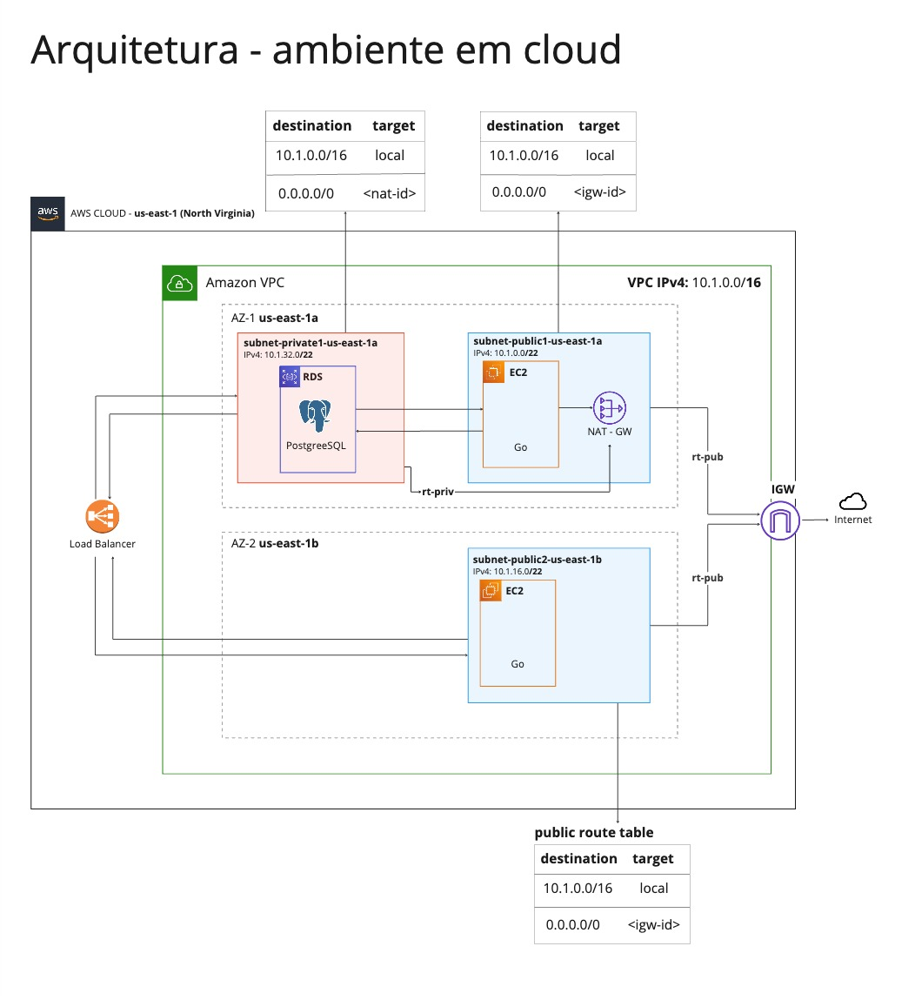

# Welcome to your CDK Go project!

This is a blank project for AWS Cloud Development Kit (CDK) development with Go. The CDK is a framework for defining cloud infrastructure in code and provisioning it through AWS CloudFormation.

The `cdk.json` file tells the CDK toolkit how to execute your app. It defines the app's entry point as well as any context values that should be available to the app when it runs.

## Environment Variables

This project uses environment variables to manage AWS credentials. You should create a `.env` file in the root of your project and add the following environment variables:

```sh
CDK_DEFAULT_ACCOUNT=your-account-id
CDK_DEFAULT_REGION=your-region
```

## Deployment
To deploy the application, you can use the cdk deploy command. This command will create a CloudFormation stack and deploy your AWS resources.

Here's an example of what the output might look like:

```sh
❯ cdk deploy
...
✨  Synthesis time: 3.49s
...
AwsCdkTestStack: deploying... [1/1]
AwsCdkTestStack: creating CloudFormation changeset...
✅  AwsCdkTestStack
✨  Deployment time: 600.03s
Stack ARN:
arn:aws:cloudformation:us-east-1:246306287199:stack/AwsCdkTestStack/fc89fb70-0a99-11ef-ac37-12e6107a4de9
✨  Total time: 603.52s
```

## Testing

This project uses the built-in testing capabilities of Go. You can write unit tests for your constructs and systems and run them using the `go test` command. 

AWS CDK also provides tools for writing fine-grained assertions about the resources that a CDK app synthesizes into a CloudFormation template. 

## Useful commands

 * `cdk deploy`      deploy this stack to your default AWS account/region
 * `cdk diff`        compare deployed stack with current state
 * `cdk synth`       emits the synthesized CloudFormation template
 * `go test`         run unit tests

## Architecture

The architecture of the application is depicted in the following diagram:



### Architecture Description

This architecture is designed for a distributed application running on AWS, utilizing managed services for scalability and high availability. The infrastructure is split across two availability zones to ensure redundancy and fault tolerance. Here's a detailed description of each component:

#### Amazon Virtual Private Cloud (VPC)

- **VPC IPv4 CIDR**: `10.1.0.0/16`
- The VPC is configured to provide network isolation for the cloud resources.

#### Subnets

- **Public Subnet AZ1 (`subnet-public-us-east-1a`)**:
  - **CIDR**: `10.1.0.0/22`
  - Contains an EC2 instance running a Go application, which has Internet access through a NAT Gateway.
- **Private Subnet AZ1 (`subnet-private-us-east-1a`)**:
  - **CIDR**: `10.1.32.0/22`
  - Hosts an RDS PostgreSQL instance, secured in a private subnet without direct Internet access.
- **Public Subnet AZ2 (`subnet-public-us-east-1b`)**:
  - **CIDR**: `10.1.16.0/22`
  - Similar to the public subnet in AZ1, it contains an EC2 instance to ensure high availability of the application.
- **Routes**:
  - The public subnets have routes configured for Internet access via the Internet Gateway (IGW).
  - The private subnets utilize a NAT Gateway located in the public subnet for Internet access, allowing updates and patches.

#### EC2 Instances

- **Go Application**: EC2 instances are hosted in the public subnets of both availability zones, running Go applications, potentially serving user traffic or acting as application servers.

#### Amazon RDS

- **PostgreSQL**: An RDS instance configured to run PostgreSQL, positioned in the private subnet for additional security. Manages application data with backups and patches managed by AWS.

#### Elastic Load Balancer (ELB)

- **Load Balancer**: An ELB is configured to distribute incoming traffic among the EC2 instances across the two availability zones, enhancing the robustness and responsiveness of the application.

#### Gateways

- **Internet Gateway (IGW)**: Provides Internet access for the public subnets.
- **NAT Gateway**: Located in the public subnet, it allows instances in the private subnets to access the Internet for software updates without directly exposing those instances to the Internet.

### Conclusion

This architecture is designed to maximize the availability and scalability of the application, using network segregation to enhance the overall security of the environment. Ideal for applications that require high availability, security, and scalability within the AWS infrastructure.
